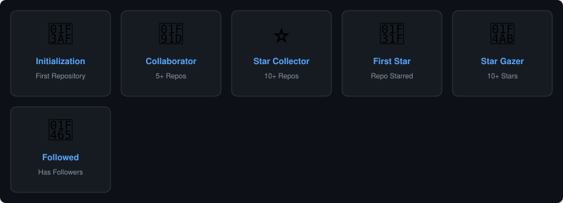

# 👋 Hey, I'm Nicolas

### 🎮 Game Developer · Software Developer · Programmer

<!-- AGE_START -->
**17 years old** · Born January 3, 2009
<!-- AGE_END -->

---

I'm a young Brazilian developer passionate about creating games and building software. I love exploring new technologies and turning ideas into playable experiences.

---

## 🎮 Game Development

Game development is where my heart is. I enjoy crafting gameplay systems, designing mechanics, and building entire worlds from scratch — one line of code at a time.

Currently working on **NikoLight**, a pixel art strategy game where you command massive armies in real-time battles.

---

## 💻 Tech Stack

---

## ⚔️ Featured Project — NikoLight

A **pixel art strategy game** focused on commanding massive armies in real-time battles.

**Key features:**

- 🏰 Fortified castle with segmented walls, gates, and defensive towers
- ⚔️ Four troop types: Knights, Archers, Tanks, and Champions
- 📐 Manual formations: Line, V, Square, and Defensive
- 🌊 Wave-based enemy system with progressive difficulty and tactics
- 🗺️ Story Mode — 10 mission campaign with boss fight
- 🎵 Procedural music and sound effects via Web Audio API
- 🎯 Real-time combat with visible projectiles and ranged archers

**Stack:** TypeScript · Canvas 2D API · Vite

---

## 📊 GitHub Stats

---

## 🏆 GitHub Trophies

---

## 📈 Activity Graph

---

## 🚀 What I'm Building

- 🎮 Games and interactive experiences
- 🏗️ Gameplay systems and mechanics
- 💡 Software projects
- 📚 Continuous learning in programming and game dev
- 🔧 Exploring new technologies and tools

---

## 📚 Currently Learning

- Game Development — advanced systems and optimization
- TypeScript — deeper patterns and architecture
- Software Engineering — clean code and design patterns
- Canvas 2D rendering and performance
- Web Audio API and procedural generation

---

## 📺 YouTube

No meu canal do YouTube, compartilho vídeos com o objetivo de espalhar o Evangelho e levar a mensagem de Cristo para mais pessoas qualquer interesse aqui está o link.

---

## 🌐 Connect with me

---

**John 14:6 Jesus answered, “I am the way and the truth and the life. No one comes to the Father except through me"**

